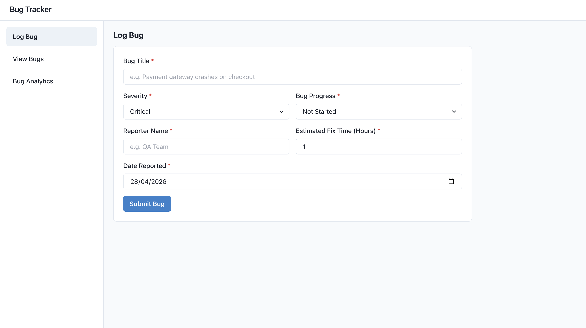
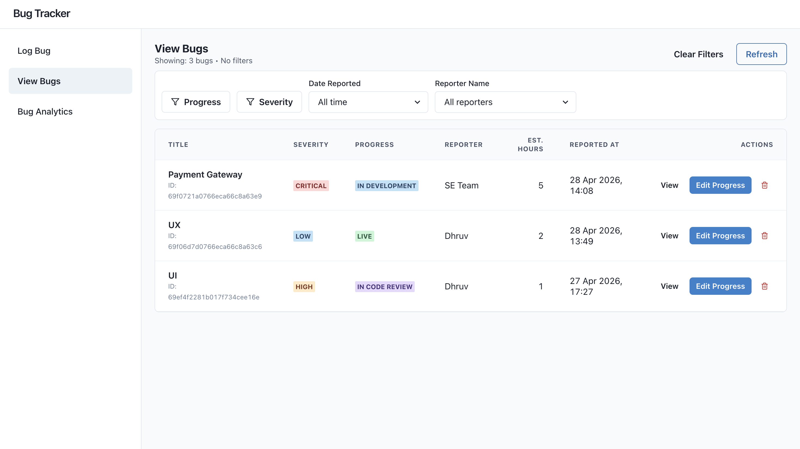
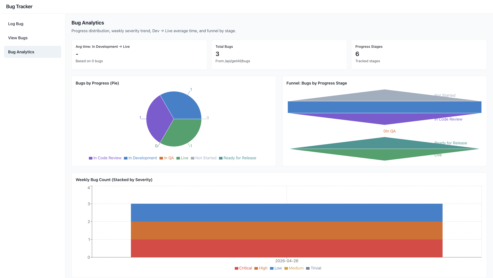

# BugTracker 🐞

**BugTracker** is a full-stack issue tracking application designed to simulate a structured software bug lifecycle workflow similar to tools used in real-world development teams.

The platform enables users to log, monitor, filter, and analyze bugs across different severity levels and progress stages, improving visibility into resolution performance through analytics dashboards.

---

## Problem Statement

In many teams, tracking bug lifecycle manually becomes inefficient and difficult to manage as projects scale.

BugTracker addresses this challenge by providing:

- structured bug reporting workflow
- filtering across lifecycle stages
- severity-based tracking
- analytics dashboards for performance monitoring

This helps teams better understand bug trends and resolution efficiency.

---

## Features

### 1. Log Bug Reports

Users can create bug reports with structured attributes such as:

- severity level
- progress stage
- reporter name
- estimated resolution time

  

---

### 2. View & Filter Bugs

Bugs can be filtered dynamically based on:

- severity
- workflow stage
- reporter
- time range

This simulates real-world filtering pipelines used in issue-tracking systems.

  

---

### 3. Bug Analytics Dashboard

Interactive analytics dashboard provides insights into:

- severity distribution
- bug progress funnel tracking
- resolution trends
- workflow stage performance

Helps monitor productivity and identify bottlenecks in bug resolution.

  

---

## Backend Highlights

The backend is designed using modular REST APIs supporting:

- bug creation workflows
- filtering pipelines
- analytics computation
- dashboard-ready aggregated responses

Efficient MongoDB queries were implemented to support dynamic filtering and reporting features.

---

## Tech Stack

### Frontend
- React

### Backend
- Node.js
- Express.js

### Database
- MongoDB

---

## Key Learnings

- Designing workflow-driven backend systems
- Implementing multi-parameter filtering pipelines
- Building analytics-ready APIs
- Structuring dashboard-supporting backend responses
- Modeling real-world issue tracking lifecycle

---

## Future Improvements

Possible enhancements include:

- authentication & role-based access
- team-level dashboards
- bug assignment workflows
- comment threads on bug reports
- notification system
